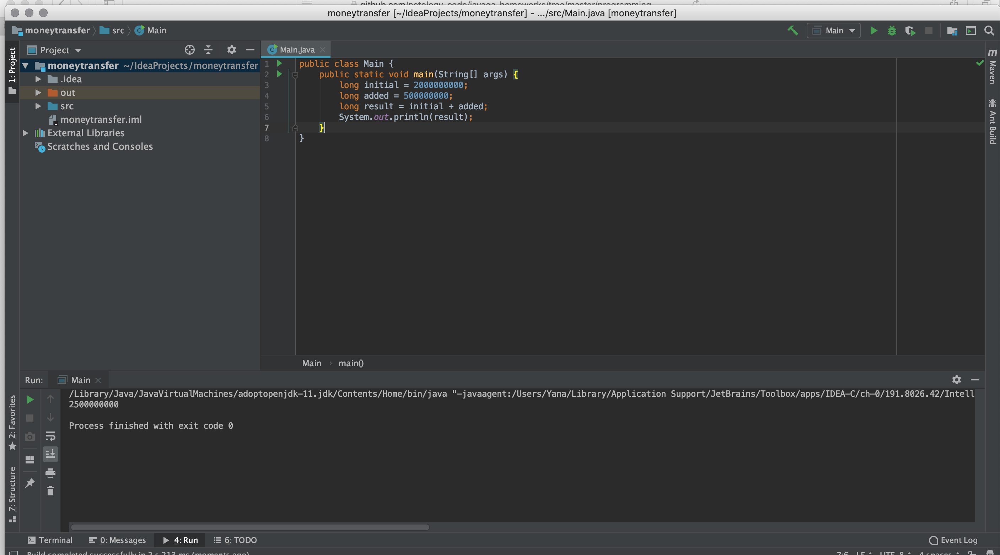

'''public class Main {
    public static void main(String[] args) {
        long initial = 2000000000;
        long added = 500000000;
        long result = initial + added;
        System.out.println(result);
    }
}'''

Run result:

